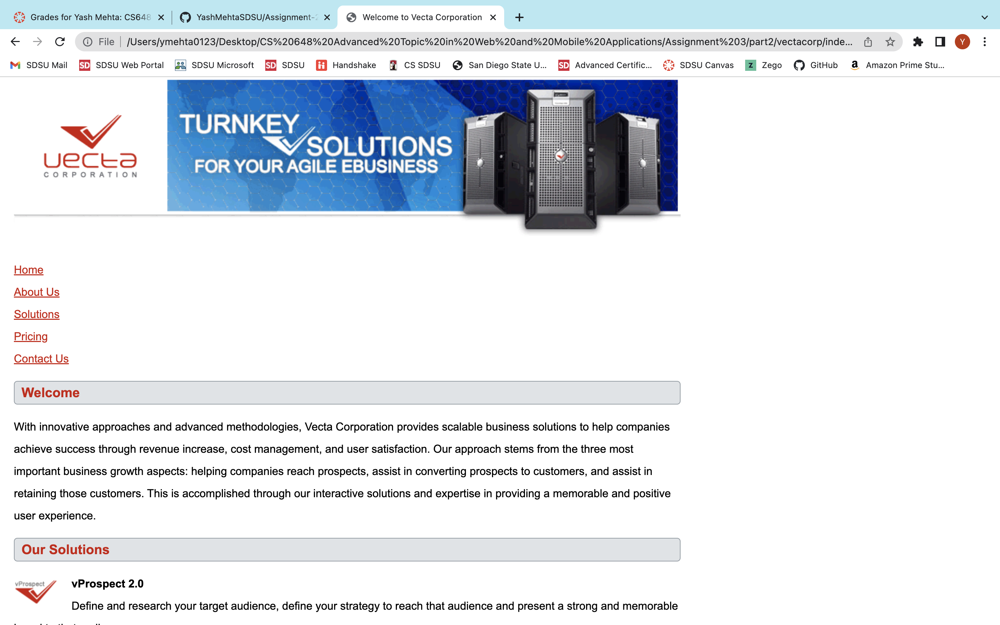
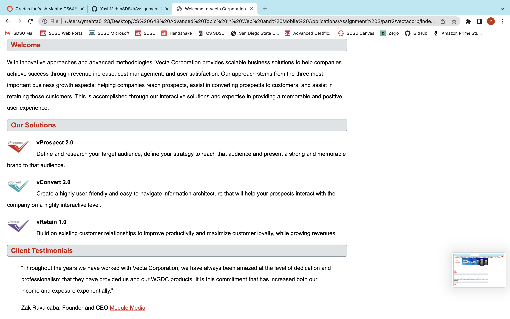
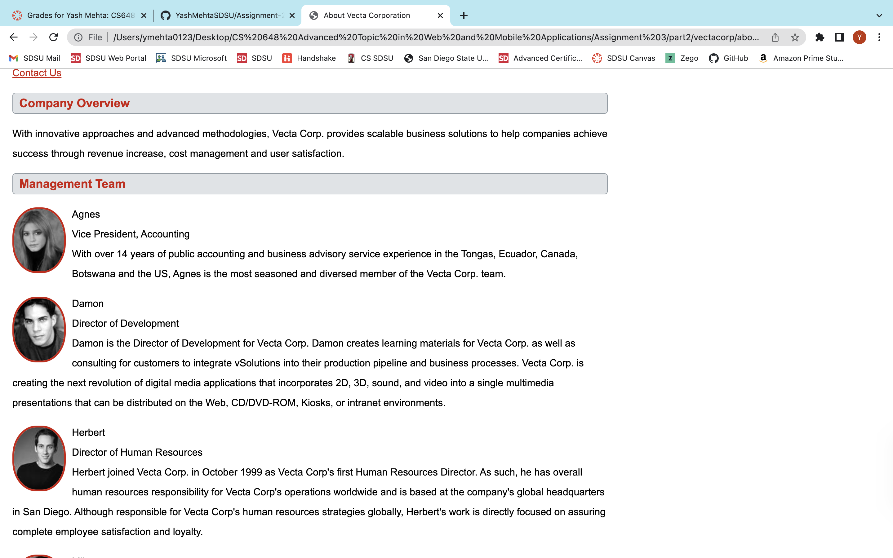
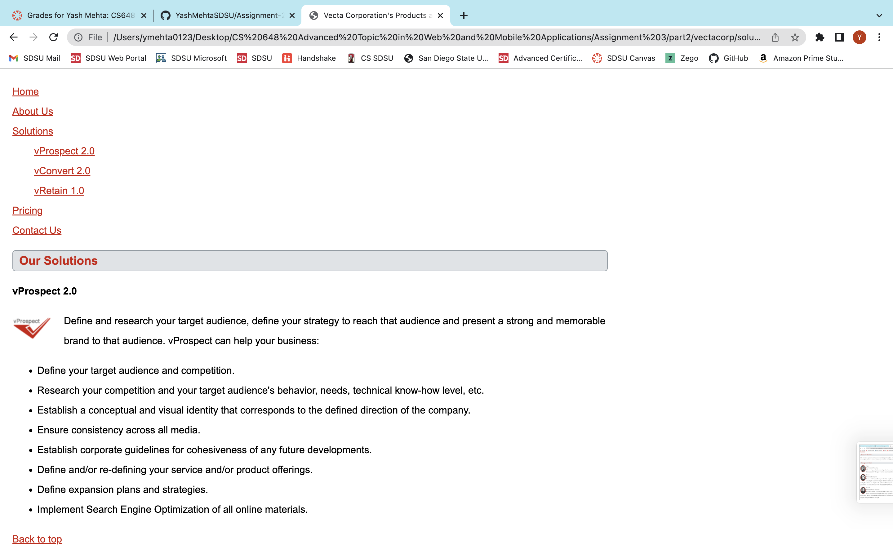
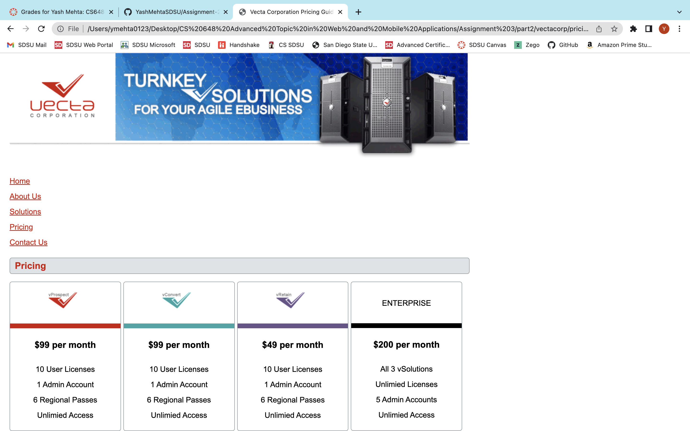
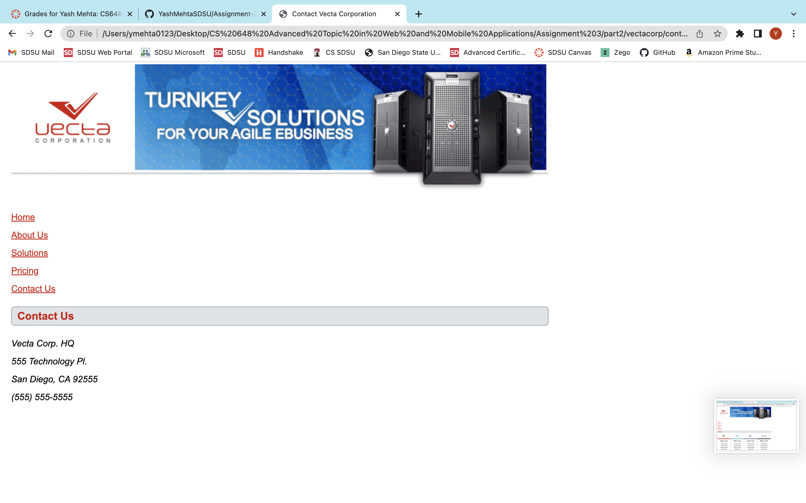

# cs648 Lab 3 submission
### Created and submitted by YashMehtaSDSU (RedID : 827508169)

*This project consists for 5 html pages and those are: *
1) The __Home__ page describes vecta corp, and details about the owner.
2) The __Contact Us__ page is a relatively small and simple page that gives the location details.
3) The __Solutions__ page describes the product offering of vecta corp.
4) The __About Us__ page lists out the team of vecta corp.
5) The __Pricing__ page lists out the Rates of vecta corp.

